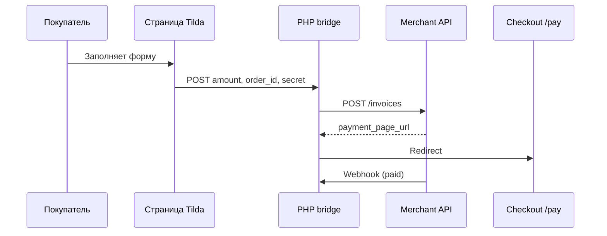

# Tilda

На Tilda **нельзя** хранить API secret в Zero Block — нужен серверный **bridge**.

## Схема



## Установка bridge

1. Скопируйте `integrations/tilda/bridge/` на хостинг, например `https://pay.example.com/noren-bridge/`.
2. `cp config.example.php config.php` — заполните ключи.
3. Создайте каталог `data/orders` с правами записи для PHP.
4. В кабинете мерчанта Webhook URL: `https://pay.example.com/noren-bridge/webhook`

### Apache (.htaccess)

```apache
RewriteEngine On
RewriteCond %{REQUEST_FILENAME} !-f
RewriteRule ^webhook$ index.php [L,QSA]
```

### Nginx

```nginx
location /noren-bridge/ {
    try_files $uri $uri/ /noren-bridge/index.php?$query_string;
}
location = /noren-bridge/webhook {
    fastcgi_pass unix:/run/php/php8.2-fpm.sock;
    include fastcgi_params;
    fastcgi_param SCRIPT_FILENAME /var/www/noren-bridge/index.php;
}
```

## Zero Block на Tilda

1. Добавьте блок **T123 HTML**.
2. Вставьте код из `embed/checkout-form.html`.
3. Замените URL формы и `FORM_SECRET` (тот же, что `form_secret` в config.php).

## Проверка статуса

`GET https://pay.example.com/noren-bridge/?order=tilda-abc123` — JSON со статусом (для thank-you страницы через iframe или свой backend).

## Альтернатива: Tilda + свой backend

Если уже есть API на Node/PHP — не используйте bridge: форма Tilda шлёт webhook на ваш сервер, а сервер вызывает Merchant API (см. `integrations/shared/php/NorenApiClient.php`).
